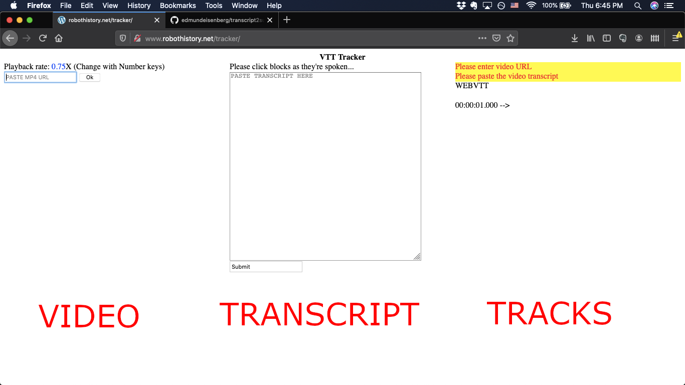

Documentation for Robot History VTT Tracker Tool

## Premise

A JS-based applet that breaks a long-form transcript into word-groups and facilitates manual, speed-controlled time-stamping of subtitle tracks.  Resulting subtitle tracks may be saved as VTT (virtual text track) and used in HTML5 video elements. 

## Intended Use

This app was designed to provide shortcut-assisted manual time-stamping of subtitle tracks based on human-transcribed text.  The app is designed specifically to use transcripts copied or scraped from [this wiki repository](https://ethw.org/Oral-History:Robotics_History:_Narratives_and_Networks) but will work with any form of transcript text.

## Page Layout

The page layout of transcript2sub is divided into three modules.  These are: video, transcript, and tracks.  Accordingly, the browser window is divided up into respective thirds containing said modules, as pictured here:



Currently there is no mobile version of the applet.

## Notes on the Code

Dependencies: JQuery

## Note on the VTT Format

For documentation of the VTT format please go to [Mozilla's WebVTT guide](https://developer.mozilla.org/en-US/docs/Web/API/WebVTT_API).

## Content Registration

Before the subtitling process can begin, the video and transcript must be submitted and registered into memory.  Upon submitting each respectively, the status of the other is evaluated and only when both have been registered can the subsequent phase begin.

#### Monitoring Variables

Several *monitoring variables* at the global scope keep track of whether these media have been respectively registered and their statuses are mirrored by the red-and-yellow flags displayed in the TRACKS pane.

```
		// change when source video, transcript are provided
	var video_loaded = false;
	var transcript_loaded = false;
	var running=false;
```

#### Video Registration

As previously with the monitoring variables, video registration modifies a variable in the global scope, `video`.  On submitting the URL-input form, the following function modifies several DOM node objects, including the element with id, `#active_video` in which all `<video>` tags are appended.  Furthermore, parameters are defined here as well.

```
$("#submit_mp4").click(function () {

	// load the video from link supplied	
	var video_url = document.getElementById("mp4_url").value;
	var video_html='<source src="' + video_url + '"/>';
	$("#active_video").html(video_html);

	// resize the player
	var video_width = $("#video_column").width();
	document.getElementById("active_video").style.width = ''+video_width-12;

	// hide the submission form and request flag 
	document.getElementById("mp4_submission").style.display = "none";
	document.getElementById("url_flag").style.display = "none";
	video = $("#active_video")[0];
	video.playbackRate= .75;

	// check if both sources are supplied
	video_loaded = true;
	if(transcript_loaded){
	   runTracker();
	}
});
```

#### Transcript Registration

This function specifically accounts for the HTML formatting of OHR interview transcripts as found here: *** FIND***  

The word-grouping algorithm goes something like this:<br>
*1.* The transcript is broken up into phrases, determined by various punctuation marks, using `<p>` tags as delimiting characters.<br>
*2.* Each phrase is word-counted and, if fewer than 24 words, joined with the consecutive phrase.  This process repeats until the total word-count exceeds 24, comprising a complete word-group.<br>
*3.* Each word group is embedded within a distinct `<p>` element.  This will allow for onclick events during the [time-stamping process](#UIUX).

```
$("#submit_transcript").click(function () {
	var transcript_text=document.getElementById("transcript_entry").value;
		// hide submission elements
	document.getElementById("transcript_submission").style.display = "none";
	document.getElementById("transcript_flag").style.display = "none";

		// create holder for parsed transcript
	var parsed_transcript=transcript_text;
	
		// break transcript into punctuated phrases, for more readable word groups later
	parsed_transcript = parsed_transcript.split('?').join('?</p><p>');
	parsed_transcript = parsed_transcript.split('!').join('!</p><p>');
	parsed_transcript = parsed_transcript.split(".").join(".</p><p>");
	parsed_transcript = parsed_transcript.split(",").join(",</p><p>");
	parsed_transcript = parsed_transcript.split("–").join("–</p><p>");

	var phrases = parsed_transcript.split("</p><p>");
	word_chunks=[];

	var id_count = 0;
	var id_tag="";

		// basically creates blocks of MINIMUM 24 words each
	for(i=0;i<phrases.length;i++){
			// make sure not to cut off any special characters
		if(phrases[i].length>2 && phrases[i].charAt(0) != "\""){
		  word_chunk = phrases[i];
			// check if meets minimum word count is met or adds more words to chunk
		  while (word_chunk.split(" ").length<=24){
			i++;
				// add the next phrase
			word_chunk+=" "+phrases[i]
			phrases.push("");
		  }
	  
		  tagged_chunk='</p><p>'+word_chunk;
		  word_chunks.push(tagged_chunk);
		  id_count++;
		}else{
		  last_index = word_chunks.length-1;
		  word_chunks[last_index]+=phrases[i];
		}
	}

		// join all work chunks
	render_transcript=word_chunks.join("");

		// and add them to DOM
	$("#transcript_renderer").html('<p>' + render_transcript+'</p>');

		// check if both sources are supplied
	transcript_loaded = true;
	if (video_loaded){
		runTracker();
	}
})
```

## Time-stamping Procedure

When the video and transcript have both been successfully inputted, `runTracker()` is invoked.

#### runTracker()

This function 
* sets `running` to true (see [monitoring variables](#Monitoring-Variables)), indicating the time-stamping interface is active.
* enables the *Download VTT* button ([detailed below](#VTT-Output)) to save subtitles to file.
* initiates playback of the video at a speed of .75X.

#### Click Events

The procedural production of subtitle tracks hinges on this particular step.  Since [word-groups were embedded into `<p>` elements before being appended into the `<div id=transcript_renderer>`](#Transcript-Registration), each `<p>` element may be assigned the same onClick functionality. This event handler incrementally hides word groups as they are clicked while also copying them into a single, time-stamped [*cue*](#Note-on-the-WebVTT-Format). Note that each click event completes the current cue's time-stamp interval while beginning the next one's.  This ensures that consecutive cues persist on-screen until the next cue begins.

```
$("#transcript_renderer").on("click",'p',function(){
		// hide the word group
    $(this).slideUp();
    	//initialize cue to add to the track
    var cue = "";
    current_timestamp = convert_timestamp(video.currentTime);
    cue+=current_timestamp + "\n" + this.textContent.replace(/\r?\n|\r/g,"") + "\n\n" + current_timestamp + " --> ";

    var vtt_text = document.getElementById("vtt_renderer").textContent + cue;
    document.getElementById("vtt_renderer").textContent=vtt_text;

})
```

#### Time-Stamp Calculator

This is just a big function that converts a quantity in seconds* into a String-representation of a time-stamp in the format, *HH:MM:S.SSS*

*Note: this may be a decimal.
```
function convert_timestamp(seconds){
  return "" + ("0"+(Math.floor(seconds/3600)%60)).slice(-2)+":"+("0"+(Math.ceil(seconds/60)-1)%60).slice(-2) + ":" + ("0"+Math.ceil(seconds%60)).slice(-2)+ (seconds%Math.floor(seconds)).toPrecision(3).substring(1,5);
}
```

#### Video Speed Controls

In the interest of accelerating the manual time-stamping process, a rudimentary video-speed UX was implemented by a keypress listener attenuated to number keys via a case-switch.  **1-9** correspond to playback-speed coefficients ranging from .5-2.5 X the normal speed, with **3** corresponding to a coefficient of 1.  Note that the case-switch is only evaluated if `running` has been set to `true` by invoking [`runTracker()`](#runTracker).

```
	// keyboard input event handler case switch
$(document).keypress(function(e) {
	var keycode = e.which;
	if(running){
		switch(keycode){
			case 49:
				speed=.5;
				break;
			case 50:
				speed=.75;
				break;
			case 51:
				speed=1.0;
				break;
			case 52:
				speed=1.25;
				break;
			case 53:
				speed=1.5;
				break;
			case 54:
				speed=1.75;
				break;
			case 55:
				speed=2.0;
				break;
			case 56:
				speed=2.25;
				break;
			case 57:
				speed=2.5;
				break;
		}
			// update heads-up display of speed
		$("#signal").html(speed);
			// change playback speed
      	video.playbackRate=speed;
	}
});
```

## VTT Output

The main objective of the applet is to produce a ready-to-use VTT file.  This means the time-stamped text content must be converted to a downloadable UTF-8 encoded file.

```
document.getElementById("download_vtt").addEventListener("click", function(){
		//remove last line of vtt content
	var text = document.getElementById("vtt_renderer").textContent;
	var text_lines = text.split('\n');
			// thanks https://love2dev.com/blog/javascript-remove-from-array/
	text_lines.pop();
	text = text_lines.join('\n');
	var filename = "tracks.vtt";
   download(filename, text);
}, false);
```

The above function only formats the accrued content into a single String, short of creating a valid file.  [Thankfully](https://ourcodeworld.com/articles/read/189/how-to-create-a-file-and-generate-a-download-with-javascript-in-the-browser-without-a-server), the latter can be done using Javascript alone by embedding our text data using JS's native `encodeURIComponent()` into the `href` attribute of a single-use `<a>` element with a `download` attribute set to the filename:
```
function download(filename, text) {
	var element = document.createElement('a');
	element.setAttribute('href', 'data:text/plain;charset=utf-8,' + encodeURIComponent(text));
	element.setAttribute('download', filename);
	element.style.display = 'none';
	document.body.appendChild(element);
	element.click();
	document.body.removeChild(element);
}
```

## Further Development

Having made some WebVTT files using this tool, there are some pretty cool possibilities to use them beyond their subtitle-cuing capacities.  One idea, imagined by Peter, was to navigate the video playhead by clicking on the corresponding word/sentence in the transcript.  By parsing the VTT track file as a data resource, this can most certainly be accomplished.  The following is a short-list of HTML DOM properties and CSS behaviors that should prove themselves helpful towards such end. 

HTML:
offsetHeight
offsetTop
offsetParent
scrollTop
document.height
window.height
etc...

CSS:
scroll-behavior: smooth

More details:
[HTML](https://www.w3schools.com/jsref/prop_element_offsettop.asp) (more in left side-bar) | [CSS](https://www.w3schools.com/howto/howto_css_smooth_scroll.asp)

Information on HTML5 video playback and navigation may be found on [w3schools.com](w3schools.com) and [developer.mozilla.org](developer.mozilla.org).

One potential hurdle in applying locally-hosted VTT tracks to remotely-hosted video is [cross-origin in/compatibility](https://developer.mozilla.org/en-US/docs/Web/HTTP/CORS).  I have, for example, succeeded in applying local tracks to IEEE-hosted video using a local development server but not using a Laughing Squid server.

## Acknowledgements:

Thanks to Peter Asaro for hiring me to write this tool and inspiring me enough to contribute further and Francis Tseng for showing me how to run a local development server from the terminal using the invaluable, `php -S localhost:8000`. Documentation made possible by [Markdown Guide](markdownguide.org)

